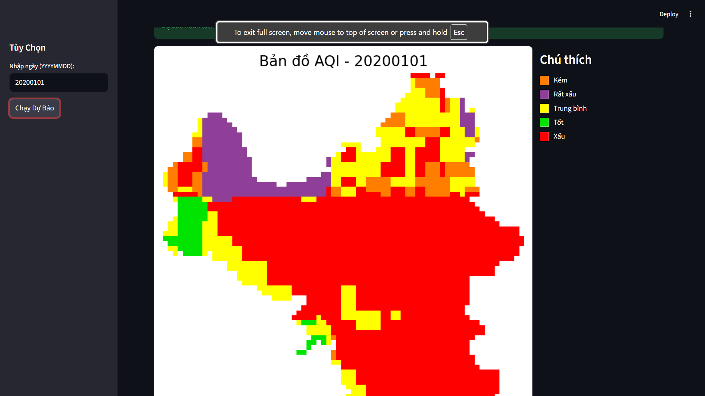
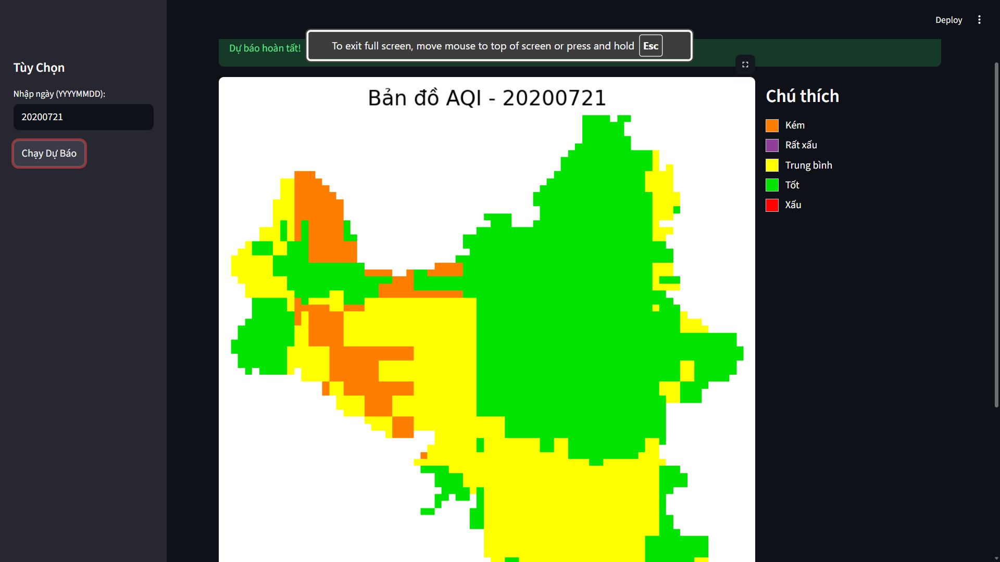

# Dự Báo Chất Lượng Không Khí (AQI)
# Chạy install 
``package pip install streamlit torch rasterio matplotlib pandas numpy joblib scikit-learn``
# Chạy visualizer 
``streamlit run app.py``
# Các ảnh mẫu

